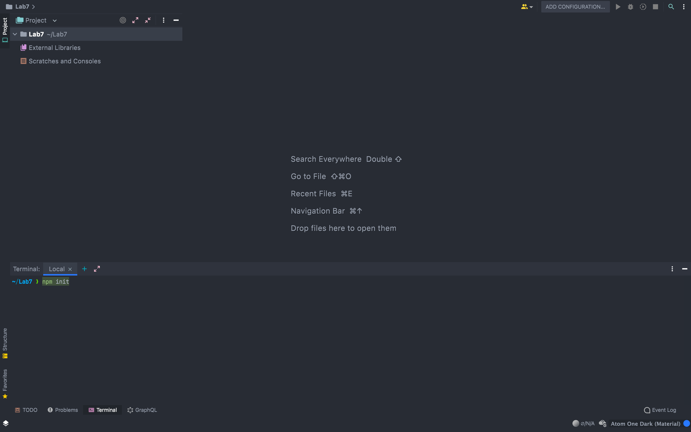
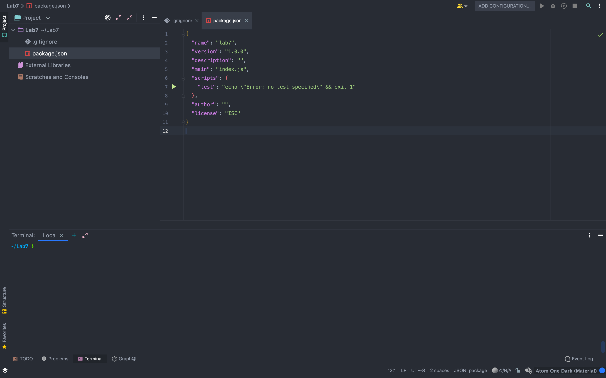
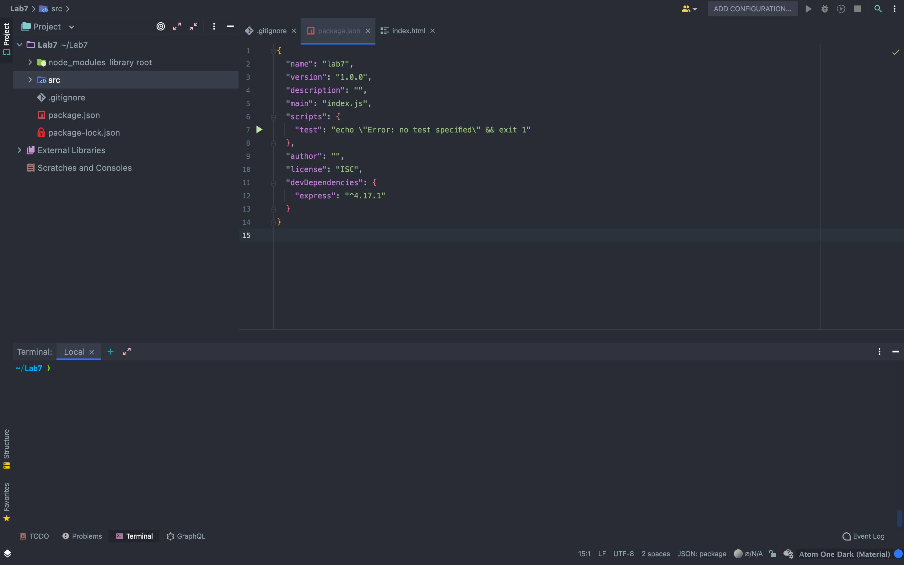
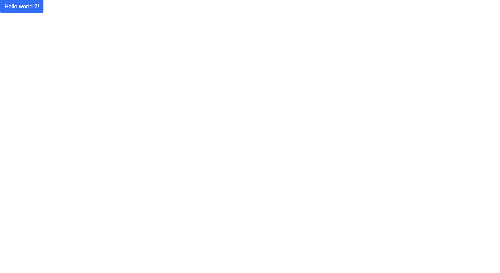

# Лабораторная работа №7 Vanila JS

В этой лабораторной работе мы напишем простой Fronted на JS для работы с нашим REST API

## План

1. Что такое npm и package.json
2. Как работать с html в JS
3. Вводная часть: как жить с API
4. Создание проекта
5. Index.html, dev сервер, bootstrap
6. Простая страничка на JS
7. Структурирование проекта
8. Верстка главной страницы под наше API
9. Верстка страницы акции под наше API
10. Подключение API

## 1. Что такое npm и package.json

Когда мы работали с питоном, то у нас был venv, где мы хранили все наши пакеты. На фронтенде для этого используется пакетный менеджер [npm](https://www.npmjs.com). С помощью него мы можем скачивать нужные нам пакеты, все скаченные пакеты храняться в папке `node_modules`, а вот информация о том, какие пакеты используются в приложении хранится в `package.json`, подробнее [тут](https://proglib.io/p/chto-takoe-npm-gayd-po-node-package-manager-dlya-nachinayushchih-2020-07-21). Этот файл хранит в себе не только информацию о скаченных пакетах, но и название приложения, версию, описание, скрипты. `package.json` можно назвать файлом, в котором хранится сведение о проекте. Он как краткое описание проекта, по нему можно понять из чего состоит проект.

## 2. Как работать с html в JS

Когда мы пишем код на JS, то нам достаточно часто нужно обращаться к верстке, для этого у нас есть общирное API по работе с [DOM деревом](https://learn.javascript.ru/dom-nodes). У нас есть все нужны для нас инструменты, чтобы мы могли обратиться к нужному нам элементу и изменить его как мы хотим. Сегодня мы будем использовать **getElementById** и **insertAdjacentHTML**, но функций намного больше.

## 3. Вводная часть: как жить с API

В предыдущей лабораторной работе мы создали наш сервер на Django REST Framework и написали API.
Теперь попробуем написать сайт, который будет работать с нашим API.
До этого мы использовали Django шаблоны, чтобы показать пользователю интерфейс и отобразить данные, но сейчас так сделать не получится. Когда мы использовали Django шаблоны, то у нас сервер выступал в роли бекенда и фронтенда сразу, то есть в нем была реализовано бизнес логика по работе с данными (бекенд) и шаблонизатор для отдачи html (фронтенд). Сейчас же нас сервер выступает в роли бекенда, который нам просто отдает данные, нам нужно написать приложение, которое будет уметь получать эти данные и выводить пользователю. У нас будет 2 независимых приложения. Бекенд на Django REST и фронтенд на JS. Сегодня в примере будет работать с API по акциям, но немного модифицированном. Приступим к делу.

## 4. Создание проекта

Для работы на фронтенде я бы посоветовал использовать IDE [WebStrom](https://www.jetbrains.com/ru-ru/webstorm/). Это инструмент от команды JetBrains, которые создали PyCharm. Только PyCharm заточен для работы с питоном, а WebStrom для работы на фронтенде.

* Заходим в меню создания проекта: **File -> New Project**
* В открывшемся окне выбираем **Empty Project**
* Задаем путь к проекту **Location**


* Теперь у нас есть пустой проект, но мы же хотим создать проект на фронтенде, для этого используем команду `npm init`



* При инициализации проекта у нас будут спрашивать много вопросов, но их все можно пропустить нажав **Enter**. Если мы захотим, то это все можно поменять в `package.json` файле

* В конце у нас появится настроенный `package.json` файл. Командой **yes** подтвержаем и созраняем его

* У нас в директории появился `package.json` файл, мы создали проект

Во все проекты принято добавлять `.gitignore` файл, который не будет добавлять лишнее в наш git репозиторий. Подробнее о `.gitignore` можно почитать [тут](https://tyapk.ru/blog/post/gitignore)

* Для добавления `.gitignore` файла просто скачаем его [тут](./assets/.gitignore) и поместим в нашу директорию

* У нас есть проект состоящий из `package.json` и `.gitignore` файлов. Может приступать к написанию кода



## 5. Index.html, dev сервер, bootstrap

Окей, мы создали проект, теперь давайте начнем его писать. Когда пользователь заходит на сайт, то ему сначала подгружается `index.html` файл с базовой версткой, а потом уже подгружаются стили и скрипты.

* Создаем файл `index.html` и кладем его в `src/index.html`

```html
<!DOCTYPE html>
<html lang="en">
<head>
    <meta charset="UTF-8">
    <title>Lab7</title>
</head>
<body>
<div>Hello world!</div>
</body>
</html>
```

Если мы откроем html файл, то увидим нашу страницу


Круто, у нас есть базовый html файл и мы можем его открыть, но каждый раз открывать html файл не круто, вот бы можно было написать какой-то сервер, который бы нам отдавал наши файлы и мы могли как в Django зайти на какой-то урл и увидеть наш сайт. Для этого можно использовать простой сервер [express](https://github.com/expressjs/express) который будет отдавать нам файлы

* Устанавливаем express через команду `npm install express --save-dev`

* Как мы видим у нас добавился пакет в `package.json` и добавилась папка `node_modules`, где хранится наш пакет



* Мы установили express, теперь нам нужно настроить наш сервер. Для этого создадим `server/index.js`

```js
'use strict';

const express = require('express');
const path = require('path');
const app = express();
const htmlPath = path.resolve(__dirname, '..', 'src/index.html')
const staticPath = path.resolve(__dirname, '..', 'src')
const port = 3000;

app.use('/', express.static(staticPath));

app.all('*', (req, res) => {
    res.sendFile(htmlPath);
});

app.listen(port, () => {
    console.log(`Server listening http://localhost:${port}`);
});
```

* Для запуска сервера используем команду `node server`. Теперь если мы перейдем на по урлу <http://localhost:3000>, то сможем увидеть наш сайт. Если выключить сервер, то сайт работать не будет, поэтому во время работы сервер должен быть включен

Для того, чтобы было проще верстать я буду использовать [bootstrap](https://bootstrap-4.ru). Это библиотека стилей, в которой можно брать верстку и применять у себя на сайте

* Для установки нам нужно в `index.html` файл добавить 2 строчки. Эти строчки подключают стили и скрипты bootstrap

```html
<!DOCTYPE html>
<html lang="en">
<head>
    <meta charset="UTF-8">
    <title>Lab7</title>
    <link rel="stylesheet" href="https://cdn.jsdelivr.net/npm/bootstrap@5.1.1/dist/css/bootstrap.min.css">
</head>
<body>
<div>Hello world!</div>

<script src="https://cdn.jsdelivr.net/npm/bootstrap@5.1.1/dist/js/bootstrap.bundle.min.js"></script>
</body>
</html>
```

* Проверим, что мы успешно подключили bootstrap. Для этого добавим кнопку из библиотеки компонентов в `index.html`

```html
<!DOCTYPE html>
<html lang="en">
<head>
    <meta charset="UTF-8">
    <title>Lab7</title>
    <link rel="stylesheet" href="https://cdn.jsdelivr.net/npm/bootstrap@5.1.1/dist/css/bootstrap.min.css">
</head>
<body>
<button type="button" class="btn btn-primary">Hello world!</button>

<script src="https://cdn.jsdelivr.net/npm/bootstrap@5.1.1/dist/js/bootstrap.bundle.min.js"></script>
</body>
</html>
```


Как мы видим наша кнопка видна, значит мы все подключили успешно и можно переходить к написанию JS

## 6. Простая страничка на JS

Теперь попробуем нарисовать нашу кнопку с помощью JS. Для того, чтобы в JS получить доступ к нашему html у нас должен быть какой-то корневой элемент который будет нашим родителем и к которому мы будем добавлять остальные элементы.

* Добавим корневой элемент в `index.html`

```html
<!DOCTYPE html>
<html lang="en">
<head>
    <meta charset="UTF-8">
    <title>Lab7</title>
    <link rel="stylesheet" href="https://cdn.jsdelivr.net/npm/bootstrap@5.1.1/dist/css/bootstrap.min.css">
</head>
<body>
<div id="root"></div>

<script src="https://cdn.jsdelivr.net/npm/bootstrap@5.1.1/dist/js/bootstrap.bundle.min.js"></script>
</body>
</html>
```

Теперь у нас есть корневой элемент к которому мы можем обратиться из JS. Создадим js, подключим его и попробуем обратиться к html.

* Создаем файл `main.js` и кладем его в `src/main.js`. Для доступа к html мы будем использовать **getElementById**, подробнее можно почитать [тут](https://developer.mozilla.org/ru/docs/Web/API/Document/getElementById)

```js
const root = document.getElementById('root');
```

* Подключаем этот файл в `index.html`

```html
<!DOCTYPE html>
<html lang="en">
<head>
    <meta charset="UTF-8">
    <title>Lab7</title>
    <link rel="stylesheet" href="https://cdn.jsdelivr.net/npm/bootstrap@5.1.1/dist/css/bootstrap.min.css">
</head>
<body>
<div id="root"></div>
<script src="main.js" type="module"></script>

<script src="https://cdn.jsdelivr.net/npm/bootstrap@5.1.1/dist/js/bootstrap.bundle.min.js"></script>
</body>
</html>
```

* У нас в `main.js` файле есть root элемент. Попробуем в него добавить нашу кнопку. Для этого будем использовать **insertAdjacentHTML**, подробнее можно почитать [тут](https://developer.mozilla.org/ru/docs/Web/API/Element/insertAdjacentHTML)

```js
const root = document.getElementById('root');

root.insertAdjacentHTML('beforeend', '<button type="button" class="btn btn-primary">Hello world 2!</button>')
```



Как мы видим наша кнопка видна, значит мы правильно написали наш JS. Теперь попробуем сделать что-то посложнее.

## 7. Структурирование проекта

Мы смогли написать простую страничку на JS, но мы же не будем вечно писать все в одном файле. Нам нужно как-то разбивать наш проект по файлам.

Сейчас мы имеем следующее разбиение по файлам:

```bash
├── package-lock.json
├── package.json
├── server
│   └── index.js
└── src
    ├── index.html
    └── main.js
```

В фронтенде верстку разделяют на страницы (Pages) и компоненты  (Components). Страницы - это отдельная страница, например наша главная страница. Компоненты - маленькие блоки из которых состоит страница.

Добавим папки:

* `src/pages` - тут будут лежать наши страницы
* `src/components` - тут будут лежать наши компоненты
* `src/modules` - тут будут лежать наши утилиты, которые нам позже пригодятся

Теперь наша структура выглдит так:

```bash
├── package-lock.json
├── package.json
├── server
│   └── index.js
└── src
    ├── components
    ├── modules
    ├── pages
    ├── index.html
    └── main.js

```

Теперь попробуем переписать нашу страницу под нашу новую архитуктуру

* Создаем нашу страницу `src/pages/main/MainPage.js`

```js
export class MainPage {
    
}
```

* Наша страница должна рендериться в root элемент страницы, поэтому добавим конструктор, чтобы его получить

```js
export class MainPage {
    constructor(parent) {
        this.parent = parent;
    }
}
```

* У нас есть элемент, теперь нам нужна функция, которая будет рендерить страницу. Добавим ее

```js
export class MainPage {
    constructor(parent) {
        this.parent = parent;
    }
    
    render() {
        
    }
}
```

* Теперь добавим логику рендера кнопки на странице

```js
render() {
    this.parent.insertAdjacentHTML('beforeend', '<button type="button" class="btn btn-primary">Hello world 3!</button>')
}
```

* У нас готов класс для главной страницы, попробуем его добавить в наш `main.js`

```js
import {MainPage} from "./pages/main/MainPage.js";

const root = document.getElementById('root');

const mainPage = new MainPage(root)
mainPage.render()
```


Проверяем, все работает, но мы сказали что у нас страница состоит из мелких компонентов, а сейчас верстка кнопки происходит на странице. Вынесем кнопку в компонент и добавим ее на странице.

* Создаем наш компонент `src/components/button/ButtonComponent.js`

```js
export class ButtonComponent {
    constructor(parent) {
        this.parent = parent;
    }

    render() {
        this.parent.insertAdjacentHTML('beforeend', '<button type="button" class="btn btn-primary">Hello world 4!</button>')
    }
}
```

* Подключаем наш компонент на странице

```js
render() {
    const button = new ButtonComponent(this.parent)
    button.render()
}
```


Отлично, у нас все работает. Теперь сделаем нашу страницу такой, чтобы она была готова с нашим API

## 8. Верстка главной страницы под наше API

Теперь модифицируем нашу страницу так, чтобы она была готова для отображения данных, которые отдает наше API. Для отображения одной акции я буду использовать [карточки](https://bootstrap-4.ru/docs/5.1/components/card/). Создадим карточку для наших акций

* Создаем компонент карточки `src/components/stock-card/StockCardComponents.js`

```js
export class StockCardComponent {
    constructor(parent) {
        this.parent = parent;
    }

    render() {
        
    }
}
```

* Теперь добавим верстку карточки. Для удобства я буду выносить верстку в функцию

```js
getHTML() {
        return (
            `
                <div class="card" style="width: 300px;">
                    
                    <div class="card-body">
                        <h5 class="card-title">Акция</h5>
                        <p class="card-text">Вот тут информация об акции</p>
                        <button class="btn btn-primary"">Нажми на меня</button>
                    </div>
                </div>
            `
        )
    }

render() {
    const html = this.getHTML()
    this.parent.insertAdjacentHTML('beforeend', html)
}
```

* Теперь добавим наш компонент на страницу

```js
render() {
    const stockCard = new StockCardComponent(this.parent)
    stockCard.render()
}
```


Отлично, у нас все работает, но нам бы хотелось прокидывать данные в компонент, а то сейчас у нас данные захардкожены в компоненте.

* Добавим отрисовка компонента из данных

```js
getHTML(data) {
        return (
            `
                <div class="card" style="width: 300px;">
                    
                    <div class="card-body">
                        <h5 class="card-title">${data.title}</h5>
                        <p class="card-text">${data.text}</p>
                        <button class="btn btn-primary">Нажми на меня</button>
                    </div>
                </div>
            `
        )
    }

render(data) {
    const html = this.getHTML(data)
    this.parent.insertAdjacentHTML('beforeend', html)
}
```

* Теперь нам нужно прокидывать данные в компонент со страницы. Функция getData будет выдавать тестовые данные, потом в ней мы будем делать поход на бекенд и получать реальные данные

```js
getData() {
    return {
        id: 1,
        src: "https://i.pinimg.com/originals/c9/ea/65/c9ea654eb3a7398b1f702c758c1c4206.jpg",
        title: "Акция",
        text: "У меня есть крутая акция"
    }
}

render() {
    const data = this.getData()
    const stockCard = new StockCardComponent(this.parent)
    stockCard.render(data)
}
```


Отлично, мы начились прокидывать данные в компонент, теперь нам бы хотелось отрисовать больше чем один компонент. У нас же по API может приходить список акция. Добавим на главной странице отрисовку списка.

* Добавим родительский элемент на главной, куда будем вставлять все наши компоненты

```js
get page() {
    return document.getElementById('main-page')
}

getHTML() {
    return (
        `
            <div id="main-page" class="d-flex flex-wrap"><div/>
        `
    )
}

render() {
    this.parent.innerHTML = ''
    const html = this.getHTML()
    this.parent.insertAdjacentHTML('beforeend', html)
        
    const data = this.getData()
    const stockCard = new StockCardComponent(this.page)
    stockCard.render(data)
}
```

* Теперь поменяем функцию getDate, чтобы она отдавала массив данных и отрисуем компоненты по этому массиву

```js
getData() {
    return [
        {
            id: 1,
            src: "https://i.pinimg.com/originals/c9/ea/65/c9ea654eb3a7398b1f702c758c1c4206.jpg",
            title: "Акция",
            text: "Такой акции вы еще не видели 1"
        },
        {
            id: 2,
            src: "https://i.pinimg.com/originals/c9/ea/65/c9ea654eb3a7398b1f702c758c1c4206.jpg",
            title: "Акция",
            text: "Такой акции вы еще не видели 2"
        },
        {
            id: 3,
            src: "https://i.pinimg.com/originals/c9/ea/65/c9ea654eb3a7398b1f702c758c1c4206.jpg",
            title: "Акция",
            text: "Такой акции вы еще не видели 3"
        },
    ]
}

render() {
    this.parent.innerHTML = ''
    const html = this.getHTML()
    this.parent.insertAdjacentHTML('beforeend', html)

    const data = this.getData()
    data.forEach((item) => {
        const stockCard = new StockCardComponent(this.page)
        stockCard.render(item)
    })
}
```


Отлично, мы смогли отрисовать сразу несколько компонентов, но если мы попробуем нажать на кноку, то ничего не произойдет. Добавим обработку нажатия на кнопку. Для этого нам нужно внутри компонента подписаться на событие клик по кнопке и обработать его. Фнукцию, которая будет срабатывать по клику будем прокидывать в компонент из страницы

* Добавим нашей кнопке уникальный id, чтобы по нему мы могли найти кнопку и подписаться на событие клика

```js
<button class="btn btn-primary" id="click-card-${data.id}" data-id="${data.id}">Нажми на меня</button>
```

* Теперь у кнопки есть уникальный id и мы можем подписаться на клик на нее. Для подписки на событие используется функция **addEventListener**, подробнее [тут](https://developer.mozilla.org/ru/docs/Web/API/EventTarget/addEventListener)

```js
addListeners(data, listener) {
    document
        .getElementById(`click-card-${data.id}`)
        .addEventListener("click", listener)
}

render(data, listener) {
    const html = this.getHTML(data)
    this.parent.insertAdjacentHTML('beforeend', html)
    this.addListeners(data, listener)
}
```

* Теперь добавим на главной функцию, которая будет срабатывать по нажатию и прокинем ее в компонент. При создании кнопки мы добавили ей data атрибут, чтобы при обработке мы могли его достать и узнать по какому элементу кликнули. Подробнее про события [тут](https://developer.mozilla.org/ru/docs/Web/API/Event)

```js
clickCard(e) {
    const cardId = e.target.dataset.id
}

const stockCard = new StockCardComponent(this.page)
stockCard.render(item, this.clickCard.bind(this))
```

Теперь у нас есть все что нам нужно, осталось создать вторую страницу и отрисовать ее

## 9. Верстка страницы акции под наше API

Теперь сверстаем страницу акции под наше API

* Создаем страницу акции `src/stock/StockPage.js`. Наша страница будет принимать дополнительный аргумент id выбранной акции

```js
export class StockPage {
    constructor(parent, id) {
        this.parent = parent
        this.id = id
    }

    getData() {
        return {
            id: 1,
            src: "https://i.pinimg.com/originals/c9/ea/65/c9ea654eb3a7398b1f702c758c1c4206.jpg",
            title: "Акция",
            text: "Такой акции вы еще не видели"
        }
    }

    get page() {
        return document.getElementById('stock-page')
    }

    getHTML() {
        return (
            `
                <div id="stock-page">
                </div>
            `
        )
    }

    render() {
        this.parent.innerHTML = ''
        const html = this.getHTML()
        this.parent.insertAdjacentHTML('beforeend', html)
    }
}
```

* Теперь создадим компонент, который будет отрисовываться на странице акции `src/components/stock/StockComponent.js`

```js
export class StockComponent {
    constructor(parent) {
        this.parent = parent
    }

    getHTML(data) {
        return (
            `
                <div class="card mb-3" style="width: 540px;">
                    <div class="row g-0">
                        <div class="col-md-4">
                            
                        </div>
                        <div class="col-md-8">
                            <div class="card-body">
                                <h5 class="card-title">${data.title}</h5>
                                <p class="card-text">${data.text}</p>
                            </div>
                        </div>
                    </div>
                </div>
            `
        )
    }

    render(data) {
        const html = this.getHTML(data)
        this.parent.insertAdjacentHTML('beforeend', html)
    }
}
```

* Добавим отрисовку компонента на странице акции

```js
 render() {
    this.parent.innerHTML = ''
    const html = this.getHTML()
    this.parent.insertAdjacentHTML('beforeend', html)

    const data = this.getData()
    const stock = new StockComponent(this.page)
    stock.render(data)
}
```

Теперь у нас есть страница акции, сделаем так чтобы при нажатии на карточку на главной странице он открывалась страница акции

```js
clickCard(e) {
    const cardId = e.target.dataset.id

    const stockPage = new StockPage(this.parent, cardId)
    stockPage.render()
}
```


Все работает, для удобства добавим кнопку, которая будет возвращать на главную

* Создаем компонент `src/components/back-button/BackButtonComponent.js`

```js
export class BackButtonComponent {
    constructor(parent) {
        this.parent = parent;
    }

    addListeners(listener) {
        document
            .getElementById("back-button")
            .addEventListener("click", listener)
    }

    getHTML() {
        return (
            `
                <button id="back-button" class="btn btn-primary" type="button">Назад</button>
            `
        )
    }

    render(listener) {
        const html = this.getHTML()
        this.parent.insertAdjacentHTML('beforeend', html)
        this.addListeners(listener)
    }
}
```

* Добавим эту кнопку на страницу акции

```js
render() {
    this.parent.innerHTML = ''
    const html = this.getHTML()
    this.parent.insertAdjacentHTML('beforeend', html)

    const backButton = new BackButtonComponent(this.page)
    backButton.render(this.clickBack.bind(this))

    const data = this.getData()
    const stock = new StockComponent(this.page)
    stock.render(data)
}
```

* Добавим обработчик нажатия на кнопку

```js
clickBack() {
    const mainPage = new MainPage(this.parent)
    mainPage.render()
}
```


Отлично, у нас есть кнопка, которая ведет назад на главную страницу. Теперь можно переходить к подключению нашего API

## 10. Подключение API

У нас есть приложение, но нам нужно его соединить с нашим бекендом, чтобы оно получало данные. Для этого мы будем делать fetch запросы, что это и как работает можно почитать [тут](https://learn.javascript.ru/fetch)

* Создадим модуль для работы с бекендом `src/modules/ajax.js`. В этом модуле у нас есть функция get для выполнения запроса на бекенд. После этого полученные данные парсятся и нам отдается объект из статуса и данных

```js
class Ajax {
    async get(url) {
        const response = await fetch(url, {
            method: "GET"
        });
        const responseData = await response.json();

        return {
            status: response.status,
            data: responseData
        };
    }
}

export const ajax = new Ajax();
```

* Так же для удобства создадим модуль, где будут хранится наши урлы, чтобы они были прописаны в одном месте. Создаем `src/modules/urls.js`

```js
class Urls {
    constructor() {
        this.url = 'http://localhost:8000/';
    }

    stocks() {
        return `${this.url}stocks/`
    }

    stock(id) {
        return `${this.url}stocks/${id}/`
    }
}

export const urls = new Urls()
```

* Теперь заменим нашу функцию getDate на главной странице, чтобы она работала с нашим модулем. Тут используются async функции, что это такое можно почитать [тут](https://learn.javascript.ru/async-await)

```js
async getData() {
    return ajax.get(urls.stocks())
}

async render() {
    this.parent.innerHTML = ''
    const html = this.getHTML()
    this.parent.insertAdjacentHTML('beforeend', html)

    const data = await this.getData()
    data.data.forEach((item) => {
        const stockCard = new StockCardComponent(this.page)
        stockCard.render(item, this.clickCard.bind(this))
    })
}
```

* Заменим нашу функцию getDate на странице акции

```js
async getData() {
    return ajax.get(urls.stock(this.id))
}

async render() {
    this.parent.innerHTML = ''
    const html = this.getHTML()
    this.parent.insertAdjacentHTML('beforeend', html)

    const backButton = new BackButtonComponent(this.page)
    backButton.render(this.clickBack.bind(this))

    const data = this.getData()
    const stock = new StockComponent(this.page)
    stock.render(data.data)
}
```

Теперь наше приложение работает с нашим API как мы и хотели, лаба готова. В конечном итоге наше приложение выглядит так:

```bash
├── package-lock.json
├── package.json
├── server
│   └── index.js
└── src
    ├── components
    │   ├── back-button
    │   │   └── BackButton.js
    │   ├── stock
    │   │   └── StockComponent.js
    │   └── stock-card
    │       └── StockCardComponent.js
    ├── modules
    │   ├── ajax.js
    │   └── urls.js
    ├── pages
    │   ├── main
    │   │   └── MainPage.js
    │   └── stock
    │       └── StockPage.js
    ├── index.html
    └── main.js
```

## 11. Полезные ссылочки

1. Проект, который мы сегодня сделали в методе [тут](https://github.com/alSergey/bmstu_lab7)
2. Почитать про **document** [тут](https://developer.mozilla.org/ru/docs/Web/API/Document)
3. Почитать про **insertAdjacentHTML** [тут](https://developer.mozilla.org/ru/docs/Web/API/Element/insertAdjacentHTML)
4. Почитать про **event** [тут](https://developer.mozilla.org/ru/docs/Web/API/Event)
5. Почитать про **addEventListener** [тут](https://developer.mozilla.org/ru/docs/Web/API/EventTarget/addEventListener)
6. Почитать про **promise** [тут](https://learn.javascript.ru/promise)
7. Почитать про **fetch** [тут](https://learn.javascript.ru/fetch)
8. Почитать про **async await** [тут](https://learn.javascript.ru/async-await)
